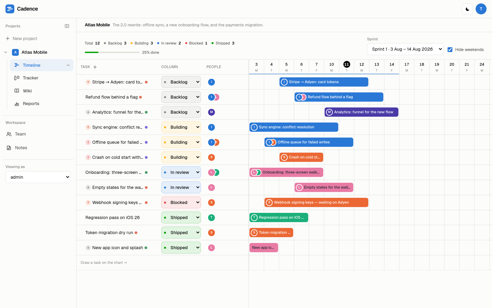
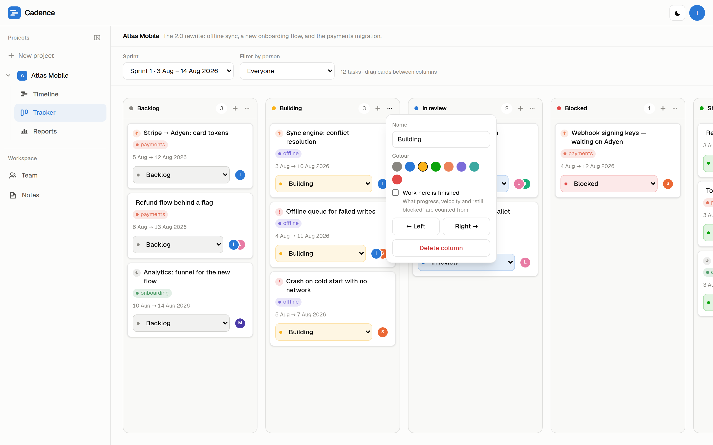
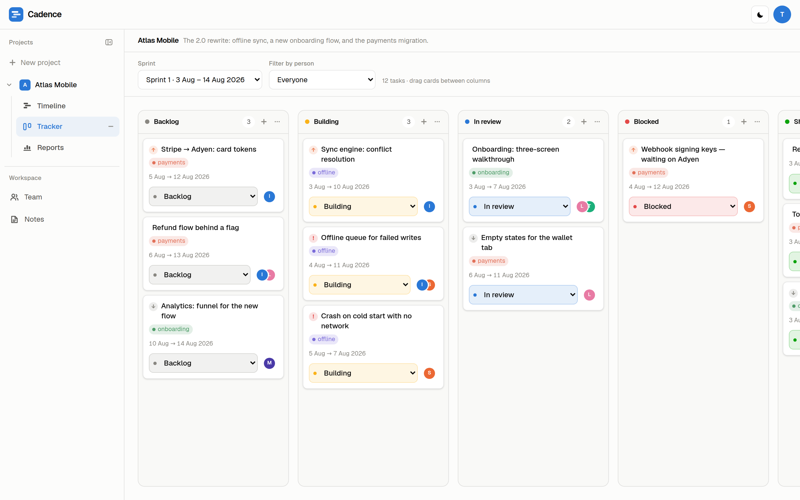
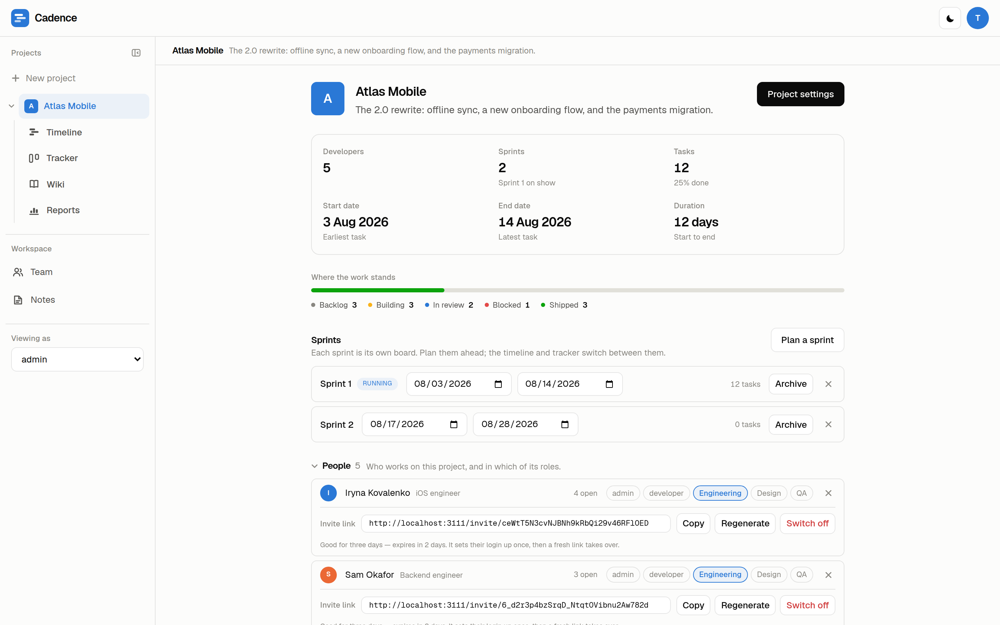
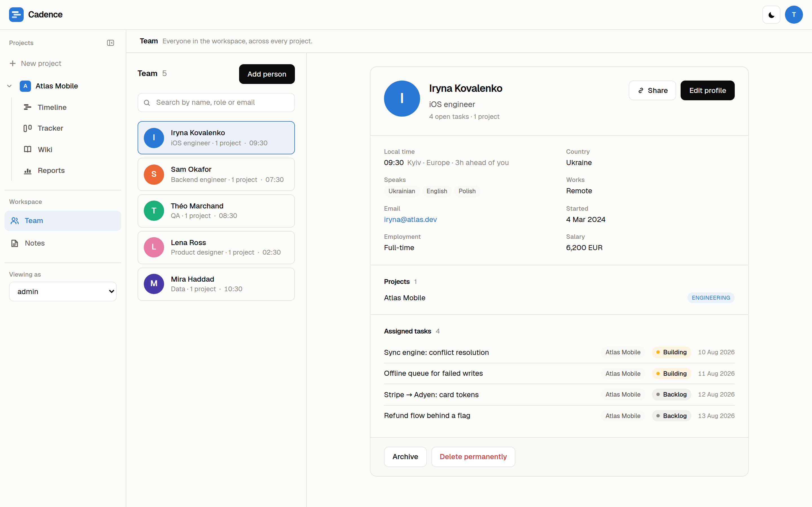
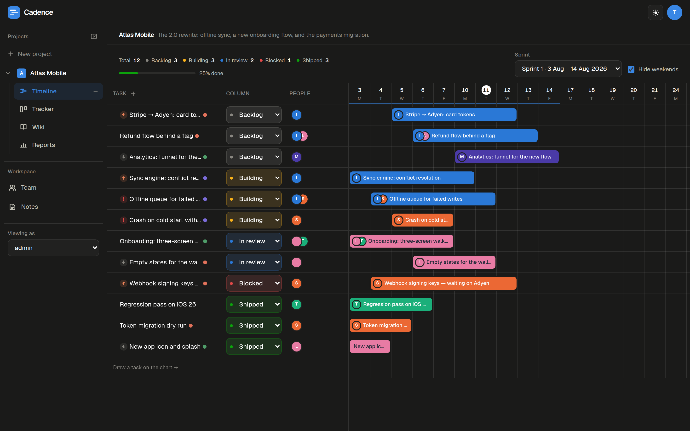

<div align="center">

# Cadence

### Sprint planning that doesn't make you choose between a Gantt chart and a board.

One set of tasks. A timeline for the plan, a kanban tracker for the day,
a roster for the people — and a board whose columns you name, colour and
order yourself, because no tool knows what your team's states are called.

[](https://nextjs.org)
[](https://react.dev)
[](https://www.typescriptlang.org)
[](https://www.prisma.io)
[](https://www.sqlite.org)
[](#quick-start)

<br />



</div>

<br />

## Why Cadence

Most tools give you one shape of the truth and sell you the other one as an
upgrade. Cadence draws the same tasks four ways and lets each project decide
which of them it wants.

|  | |
|---|---|
| **📅 Timeline** | A Gantt chart of the sprint. Drag a bar to move the work, drag its edge to change how long it takes. Weekends fold away. |
| **🗂 Tracker** | The same tasks as cards, in columns **you** name. Write them, colour them, drag the board into the order you work in, and say which column means finished. Delete the ones you don't want — properly. |
| **👥 Team** | A roster with a profile per person — what they do, what they're on, what they're carrying, and what time it is where they are. Pay and contact details stay with the workspace owner. |
| **📖 Wiki** | A per-project tree of pages for the things that aren't tasks. |
| **📈 Reports** | The project's own numbers: cumulative flow, throughput a week, cycle time, velocity a sprint, and who is carrying what. Worked out from the tasks and their history, stored nowhere. |
| **🗒 Notes** | A private pile per person, in whatever order they drag it into — right-click one to pin, copy or delete it. Nobody else in the workspace can read them. |
| **🔑 Roles & invite links** | Every project has its own roles, and a role is a list of what it opens. Invite somebody with a link that expires in three days and is spent on one login. |
| **🎚 Nothing you didn't ask for** | A project starts with everything switched off. Tick the tools it needs — and the fields a task should ask for — and the rest never appears. |

<br />

## The board is yours



Most boards hand you three or five columns and a nice word for the fact that you
can't change them. Cadence hands you an empty tracker and a text field.

- **Name them.** *Backlog*, *Building*, *In review*, *Blocked*, *Shipped* — or
  whatever your team already says out loud. Up to twenty of them.
- **Colour them.** Eight colours that tell each other apart on both themes. The
  colour is a dot beside the name, never instead of it.
- **Order them.** Move a column left or right and the whole board — cards,
  counts, the timeline's tally, the reports — moves with it.
- **Say which one means finished.** Tick it, and progress, velocity, cycle time
  and "is this still blocked" all count from there. Nothing reads the *name*, so
  *Shipped*, *Live* and *Готово* work exactly as well as *Done*.
- **Delete one and it's gone.** Not hidden from you while it stands for everyone
  else — gone. The work in it isn't deleted with it: those tasks come back on the
  board as **Unsorted**, ready to drag somewhere that still exists.

A new project's tracker starts with no columns at all, a field to write the first
one, and a familiar five behind a button for anyone who'd rather not invent a
board from scratch. Upgrading? Every project you already have keeps exactly the
board it had — the migration writes your old statuses out as columns, in order,
with Done already ticked.

<br />

## Quick start

```bash
git clone https://github.com/will-krof/gantt-chart.git
cd gantt-chart

npm install                                # also generates the Prisma client
echo 'DATABASE_URL="file:./dev.db"' > .env
npx prisma migrate deploy                  # or: npx prisma migrate dev
npm run dev
```

Open **[localhost:3000](http://localhost:3000)** and sign up — the first account
owns the workspace. Or make one from the command line, which is handy on a
fresh database:

```bash
npm run create-account -- you@example.com --name "Your Name"
```

That's the whole install. The database is a file, so there is no server to run
beside the app and nothing to provision before it starts.

<br />

## A look around

<table>
<tr>
<td width="50%"></td>
<td width="50%"></td>
</tr>
<tr>
<td><b>The tracker.</b> Columns in this team's own words, in this team's own colours. Drag cards between them with a mouse, a pen or a finger; press the <b>…</b> on any header to rename it, recolour it, move it or delete it.</td>
<td><b>The project card.</b> Everything about one project in one place: where the work stands column by column, the sprints, and who is on it — with their roles and their invite links right there.</td>
</tr>
<tr>
<td></td>
<td></td>
</tr>
<tr>
<td><b>The roster.</b> Everyone in the workspace, searchable by name, job title or email, with the projects and the work each one carries.</td>
<td><b>Dark, too.</b> One toggle in the corner, remembered per browser.</td>
</tr>
</table>

<br />

## How it fits together

```
Workspace (one account)
├── Team roster ──────────── people, with a profile each
└── Projects
    ├── Roles ───────────── what a role opens: timeline · tracker · team · wiki
    ├── People ──────────── roster ∩ project, holding roles + an invite link
    ├── Columns ─────────── the tracker's own states, named and coloured here
    ├── Sprints ─────────── each one its own board
    ├── Tasks ───────────── shared by up to four people, with steps,
    │                       dependencies, tags, comments and history
    ├── Wiki ────────────── a tree of pages
    └── Reports ─────────── the project's own numbers, worked out from the rest
```

A person is added to the **team** once and put on **projects** many times, with
different roles on each. A task belongs to a project and, if the project runs on
sprints, to a sprint. Everything else is a switch on the project card.

<br />

## The parts, in more detail

<details>
<summary><b>Accounts, invite links and how people get in</b></summary>

<br />

Signing up at `/signup` makes a workspace and makes you its admin: your
projects, your roster, your invite links, and nothing of anybody else's. Team
members don't sign up — they get a login through an invite link — and both kinds
sign in on the same form, an account by email and a member by username.

People are added to the team first, which gives them a profile and nothing more.
Inviting them is a project's business: put them on a project, tick the roles they
should hold, and their invite link appears on the project card. A link with no
role behind it would open nothing, so there isn't one until there is a role, and
taking every role away takes the link with it.

Opening the link shows them the project and the roles it carries, then asks for a
username and a password — that login is how they get in from then on, and it is
the only thing the link is spent on. From the project card:

- **Copy** hands the link over.
- **Regenerate** issues a new token, which kills the link they had.
- **Switch off** revokes the link, so nobody can use it to set a login up.

**Links last three days.** Past that the link is dead and a fresh one takes its
place — the next time an admin looks at the memberships, what they see is a live
link rather than an expired one. Once somebody has set their login up, their link
is spent and the row says so; taking them off the project is what ends their
access after that.

Somebody can be listed on a project without being on it: being handed a task puts
them there. Their row says which of the two it is, so taking a member off who
still carries work reads as what it is rather than as a button that did nothing.

</details>

<details>
<summary><b>What a project is made of</b></summary>

<br />

**A project starts with nothing switched on.** Creating one asks for a name and a
description, and then drops you on its card with the settings open — because what
a project is made of is a shorter question than what to take away from a project
that arrived with everything.

The Gantt chart, the tracker, sprints, the wiki, reports and roles are each a
checkbox,
and the team roster is not, because every project has people. Tick what this
project needs; come back under **Project settings** whenever that changes.
Switching a tool off later hides it — the sprints and roles already made are
kept, waiting where they were if it comes back.

With **sprints** off, the boards stop being one round's worth of work and show
the project's whole plan at once. With **roles** off, the permissions table and
the "viewing as" picker go — for a project one person runs, they are a screen of
questions nobody has.

**Reports** are a screen of the project's own numbers, switched on like any other
tool. A cumulative flow diagram of every task by column day by day, how much is
finished each week, how long a task takes from the day it is picked up, what each
sprint got through, and who is carrying what — worked out on the server from the
tasks and their history each time it is opened. Nothing is stored, so the numbers
are always as true as the boards, and switching it off loses nothing. The charts
are drawn in your columns' own colours and stacked in your board's own order, and
"finished" is whichever column you ticked. Every chart carries a legend and can
be read as a table: a colour somebody picked is not a palette validated for
separation, so the labels are what tell two bands apart.

A project can also say **when it runs**, rather than leaving it to be worked out
from the earliest and latest task. Set a start date, an end date, or just one of
them.

The same card says **what a task asks for**: its dates, its estimate, its
priority, its link, its tags, its steps, its dependencies, its history, its
comments. Each one can be
put away, and then the form stops offering it, the card stops drawing it, and the
boards stop marking it. Nothing already written is lost — turn a field back on and
it is all still there.

</details>

<details>
<summary><b>Tasks, sprints and the boards</b></summary>

<br />

A task is shared by **up to four people**: the boards draw a stack of faces of a
fixed width, so a row is the same size for a task shared by four as for one
nobody has picked up. Tasks carry steps, dependencies on other tasks, tags,
comments and a history of what changed and when.

**How long it should take** is a task's own field, written in whichever unit the
team thinks in. Type three days, switch the picker to hours, and the box says
twenty-four — one length of time, said two ways, and a day is eight hours. It is
stored as one quantity, so two tasks sized in different units still compare.

**Dates are optional.** Work gets written down before anybody knows when it runs,
so a task with no dates is a task nobody has placed in time yet — it sits in the
timeline's list like any other, and the chart draws no bar for it. Give it dates
and the bar appears where they put it.

A project runs as a series of **sprints**, and each one is its own board. When a
sprint is done with, **Archive** puts it away: nothing moves, and its tasks stay
where they are. It drops out of the run of sprints on the project card into an
"Archived" group, and a board never lands on it — though it can still be opened
from the sprint picker, so the work in it stays reachable. **Restore** brings it
back.

On the **tracker**, the columns are the project's own. A new tracker has none:
write the first one, pick its colour, and add the rest as the work needs them —
or take the familiar five from the button underneath and change them from there.
The **…** on a column header is where the rest lives: rename it, recolour it,
move it left or right, and tick whether work standing in it is finished.

**Deleting a column deletes it.** A column used to be hideable and nothing more,
which was never what anybody meant: the state stayed real, its tasks stayed in
it, and every picker went on offering it to whoever hadn't hidden it. Now it
goes — and the work standing in it doesn't go with it. Those tasks come back on
the board as **Unsorted**, a pile the board only draws while something is in it,
and drag into any column that still exists. Their history keeps reading, too: a
line says the name the column had when the task was moved, so *"Doing →
Shipped"* still means what it meant after *Shipped* is deleted.

Nothing anywhere reads a column's *name* to decide what finished means — the
tick does. Call the last column *Shipped*, *Live* or *Готово* and progress,
velocity, cycle time and "is this blocker cleared" all keep working.

A task is written where it will live: the **+** beside the timeline's Task
column, or the **+** on a tracker column — which also decides where the task
starts, so one written under "In review" arrives there.

In the **sidebar**, every project lists the tools it carries, open to begin with:
what the workspace is made of should be readable without clicking into it. Fold a
project away with the arrow beside it and it stays folded, per project and per
browser. Pressing a tool under a project opens that project *and* that tool,
which is what pressing it meant. Only one row is ever lit — whatever is actually
on screen. **Team** and **Notes** can each be put away with the × on their row,
and come back from the chips underneath.

</details>

<details>
<summary><b>Who reaches what</b></summary>

<br />

Every project has its own roles, and a role is a list of what it can open:
timeline, tracker, team, wiki. One role per project is the admin, which always
sees everything and is the only one that edits the project — including what the
tracker's columns are called, which is a project setting like its tags and its
roles rather than something anybody working on the board can rewrite under
everybody else. Someone can hold
several roles on the same project, and different roles on different projects.

A signed-in member reaches the projects they are on, through the roles they hold
on each. They can move the work on the boards those roles open; everything else —
the project's settings, its roles, the roster, the links themselves — stays with
the workspace's owner.

Commenting is the one thing a view-only role can still do. Opening a task shows
its history and, under it, what people have said about it: anybody who can open
the board can add to that, whether or not their role lets them change the work. A
comment can be taken back by whoever wrote it, and by the workspace's owner.

A note is read as it will look and written by clicking into it: stepping out of
the text renders it, so there is no Preview button to press. Right-clicking a
note in the list is where the rest of it lives — a new note, a copy of this one,
pinning it to the top of the pile, and deleting it.

Every profile has an address of its own — `/people/<id>` — and a **Share** button
that copies it. The link is an address, not a key: opening it takes a session and
a project shared with that person. Colleagues see the working half of a profile;
pay, contact details and notes are the workspace's own.

A profile also says where in the world somebody is: a time zone, a country, the
languages they speak, and whether they work remotely, from an office, or both.
The zone is stored — `Europe/Kyiv`, not `+03:00`, so it stays right when the
clocks change — and the card reads the time off it, ticking on the minute. It
sits beside the name on the roster as well, so scrolling the list tells you who
is still at their desk. All four are the working half of a card: a colleague
plans around them, so a colleague can see them.

</details>

<details>
<summary><b>Superadmin</b></summary>

<br />

One badge above admin, and it buys exactly one thing: a panel at the foot of the
sidebar with counts of how the install is being used — how many admins there are,
how many projects and people they have between them, and the per-workspace
numbers. No names, no emails, no project titles, and no reach whatsoever into
anybody's workspace.

It is granted from the command line, never from the app, so nothing in the app
can hand it out:

```bash
npm run make-superadmin -- you@example.com
npm run make-superadmin -- you@example.com --revoke
```

</details>

<br />

## Built with

| | |
|---|---|
| **Next.js 16** (App Router) | Server components, route handlers under `src/app/api`, Turbopack in dev |
| **React 19** | One board provider over the whole app; boards, roster and wiki fetched when first opened |
| **Prisma 6 + SQLite** | The schema in `prisma/schema.prisma`, the client generated into `src/generated/prisma` |
| **Tailwind CSS 4** | One type scale, one card, one chip, one red — themed light and dark from CSS variables |
| **Sessions in httpOnly cookies** | scrypt password hashes, hashed session tokens, rate-limited login, `no-store` on every API answer |

```
src/
├── app/            routes and route handlers (the API lives under app/api)
├── components/     the boards, the shell, the project card, the roster, the wiki
├── lib/            what the routes share: auth, scopes, input parsing, selects
└── generated/      the Prisma client (not checked in)
prisma/             schema and migrations
scripts/            create-account, make-superadmin, preflight
```

<br />

## Scripts

| Command | What it does |
|---|---|
| `npm run dev` | Dev server on :3000 (runs the preflight check first) |
| `npm run build` / `npm start` | Production build and server |
| `npm run lint` | ESLint |
| `npm run create-account -- <email> --name "Name"` | Makes a workspace account. Asks for the password without echoing it; `--password` exists for scripts, at the cost of your shell history |
| `npm run make-superadmin -- <email> [--revoke]` | Grants or takes back the superadmin badge |

<br />

## Troubleshooting

<details>
<summary><b>Turbopack can't resolve <code>@prisma/client/runtime/library</code></b></summary>

<br />

The generated client and the runtime it imports are one thing shipped as two
packages, and they have to be the same build. `npm run dev` checks this before
the dev server gets a chance to say it badly. The fix it prints:

```bash
rm -rf node_modules .next src/generated
npm ci
```

The Prisma client is generated into `src/generated/prisma`, which isn't checked
in — `npm install` generates it, so a fresh checkout needs nothing else. After
pulling a change that touches `prisma/schema.prisma`, run `npm install` (or
`npx prisma generate`) again to bring it back in step.

</details>

<details>
<summary><b>A migration says a column is already there</b></summary>

<br />

```
Error: P3018 … duplicate column name: taskHasSubtasks
Migration name: 20260730110000_task_steps_and_links_are_fields
```

That migration was released under a later timestamp and then moved earlier, so
that a database built from nothing applies it before the migration that rebuilds
the same table. A database that had already run it under the old name sees the
moved one as new and tries to add the columns a second time.

The columns are already there and the schema is right, so the migration only has
to be written down as done:

```bash
npx prisma migrate resolve --applied 20260730110000_task_steps_and_links_are_fields
npx prisma migrate deploy
```

A database created after this was written never meets it.

</details>

<br />

<div align="center">
<sub>Screenshots are of a seeded demo workspace — its columns are that team's, not ours. Sprint planning, without the ceremony.</sub>
</div>
